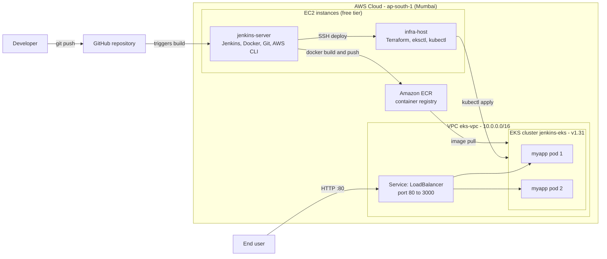
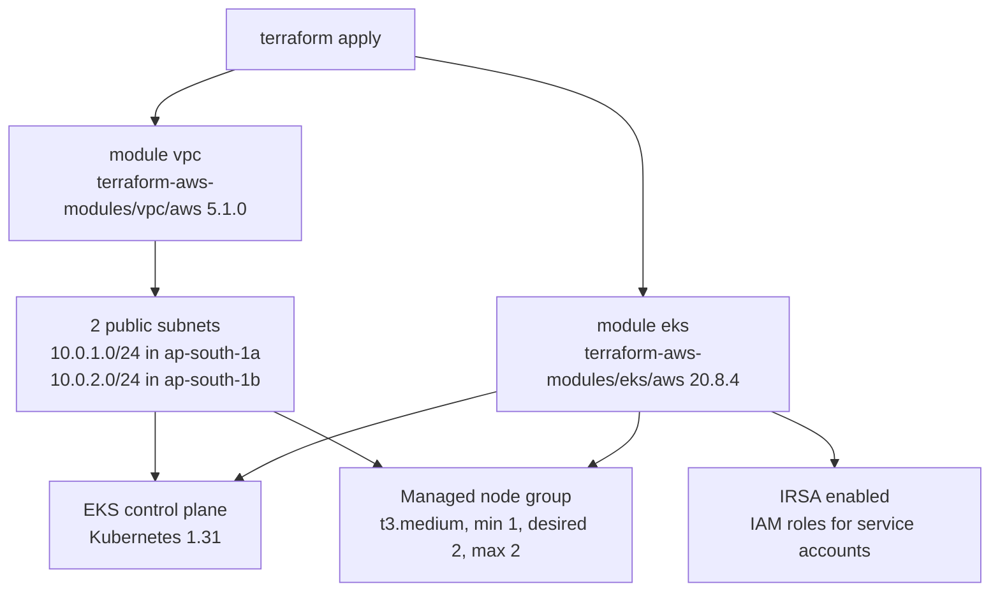
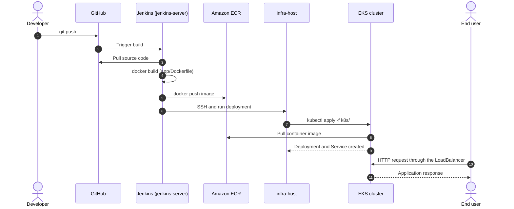

<div align="center">

# ClusterForge - CI/CD Pipeline on AWS
### Jenkins · Docker · Amazon ECR · Terraform · Kubernetes (EKS)

A complete, automated path from `git push` to a running, load-balanced application on Kubernetes, with the entire cluster provisioned as code.


</div>

---

## Table of Contents

- [Overview](#overview)
- [Architecture](#architecture)
- [How the Pipeline Works](#how-the-pipeline-works)
- [Tech Stack](#tech-stack)
- [Repository Structure](#repository-structure)
- [Infrastructure Details](#infrastructure-details)
- [Kubernetes Manifests](#kubernetes-manifests)
- [Prerequisites](#prerequisites)
- [Setup Guide](#setup-guide)
- [Verify the Deployment](#verify-the-deployment)
- [Cost and Cleanup](#cost-and-cleanup)
- [Security Practices](#security-practices)
- [Design Decisions](#design-decisions)
- [Troubleshooting](#troubleshooting)
- [Roadmap](#roadmap)
- [Skills Demonstrated](#skills-demonstrated)
- [Author](#author)

---

## Overview

This project builds a full delivery pipeline on AWS using two small EC2 instances and a managed Kubernetes cluster.

- **Continuous integration:** a push to GitHub triggers Jenkins, which builds a Docker image and pushes it to Amazon ECR.
- **Continuous delivery:** Jenkins connects to a separate infrastructure host over SSH, which applies the Kubernetes manifests to an EKS cluster.
- **Infrastructure as Code:** the VPC and the EKS cluster are defined in Terraform, so the whole environment can be created and destroyed with two commands.
- **Result:** a two-replica Node.js application behind an AWS load balancer, reachable on port 80.

**Separation of duties.** Build work runs on `jenkins-server`. Cluster tooling and credentials live on `infra-host`. Jenkins never needs direct cluster admin tooling, only an SSH path to the host that has it.

---

## Architecture

### System overview



### Infrastructure provisioned by Terraform



---

## How the Pipeline Works

### End-to-end sequence



### Stage by stage

| # | Stage | Where it runs | What happens |
|---|-------|---------------|--------------|
| 1 | **Source** | GitHub | Code is pushed to the repository |
| 2 | **Trigger** | Jenkins | The push starts a Jenkins build |
| 3 | **Build** | `jenkins-server` | Jenkins pulls the code and builds the Docker image from `app/Dockerfile` |
| 4 | **Publish** | `jenkins-server` to ECR | The image is authenticated with the AWS CLI and pushed to Amazon ECR |
| 5 | **Deploy** | `jenkins-server` to `infra-host` | Jenkins connects over SSH and triggers the deployment |
| 6 | **Release** | `infra-host` to EKS | `kubectl` applies the manifests in `k8s/` |
| 7 | **Serve** | EKS | Two pods start, pull the image from ECR and receive traffic through the load balancer |

---

## Tech Stack

| Layer | Technology | Details |
|-------|------------|---------|
| Source control | Git, GitHub | Single repository for app, manifests and infrastructure |
| CI/CD server | Jenkins | Runs on the `jenkins-server` EC2 instance |
| Containerization | Docker | `node:14` base image, application exposed on port 3000 |
| Container registry | Amazon ECR | Stores the built images |
| Infrastructure as Code | Terraform | VPC and EKS modules from `terraform-aws-modules` |
| Orchestration | Kubernetes on Amazon EKS | Version 1.31, managed node group |
| Cluster tooling | `kubectl`, `eksctl`, AWS CLI | Installed on `infra-host` |
| Application | Node.js | Minimal HTTP server using the built-in `http` module |
| Region | AWS `ap-south-1` | Mumbai, across two availability zones |

---

## Repository Structure

```
ci-cd-project/
├── app/
│   ├── Dockerfile        # Container image definition (node:14, port 3000)
│   └── index.js          # Node.js HTTP server
├── k8s/
│   ├── deployment.yaml   # 2-replica Deployment
│   └── service.yaml      # LoadBalancer Service (80 to 3000)
├── terraform/
│   └── main.tf           # VPC and EKS cluster definition
├── .gitignore            # Excludes keys, state files and local credentials
└── README.md
```

---

## Infrastructure Details

Everything below is defined in [`terraform/main.tf`](terraform/main.tf).

### Network (VPC module)

| Setting | Value |
|---------|-------|
| Module | `terraform-aws-modules/vpc/aws` version `5.1.0` |
| VPC name | `eks-vpc` |
| VPC CIDR | `10.0.0.0/16` |
| Availability zones | `ap-south-1a`, `ap-south-1b` |
| Public subnets | `10.0.1.0/24`, `10.0.2.0/24` |
| DNS support and hostnames | Enabled |
| Auto-assign public IP on launch | Enabled |

### Cluster (EKS module)

| Setting | Value |
|---------|-------|
| Module | `terraform-aws-modules/eks/aws` version `20.8.4` |
| Cluster name | `jenkins-eks` |
| Kubernetes version | `1.31` |
| Subnets | The two public subnets from the VPC module |
| IRSA (IAM roles for service accounts) | Enabled |
| Node group | `default`, managed |
| Instance type | `t3.medium` |
| Node count | desired `2`, min `1`, max `2` |
| Tags | `Environment = dev`, `Terraform = true` |

---

## Kubernetes Manifests

### Deployment: [`k8s/deployment.yaml`](k8s/deployment.yaml)

| Field | Value |
|-------|-------|
| Name | `myapp-deployment` |
| Replicas | `2` |
| Selector and pod label | `app: myapp` |
| Container name | `myapp` |
| Container port | `3000` |
| Image | Placeholder `your-ecr-repo`, replaced with your ECR image URI |

### Service: [`k8s/service.yaml`](k8s/service.yaml)

| Field | Value |
|-------|-------|
| Name | `myapp-service` |
| Type | `LoadBalancer` |
| Selector | `app: myapp` |
| Port mapping | `80` (external) to `3000` (container) |

### Application

`app/index.js` starts an HTTP server on port `3000` and answers every request with:

```
CI/CD pipeline with Jenkins, Docker, Kubernetes, and AWS
```

---

## Prerequisites

- An AWS account and permission to create VPC, EKS, EC2 and ECR resources
- Two EC2 instances (free-tier eligible types are enough):
  - `jenkins-server` with Jenkins, Docker, Git and the AWS CLI installed
  - `infra-host` with Terraform, `eksctl`, `kubectl` and the AWS CLI installed
- The AWS CLI configured on both hosts, with rights to ECR (Jenkins host) and EKS (infra host)
- An SSH key pair so `jenkins-server` can reach `infra-host`
- The Jenkins user added to the Docker group so builds can run `docker` commands
- A GitHub repository connected to Jenkins

---

## Setup Guide

### 1. Create the container registry

```bash
aws ecr create-repository --repository-name myapp --region ap-south-1
```

Note the repository URI from the output. You will use it in the manifest and the pipeline.

### 2. Provision the cluster (on `infra-host`)

```bash
cd terraform
terraform init
terraform plan
terraform apply
```

Creating the cluster and node group usually takes around 15 minutes.

### 3. Connect `kubectl` to the cluster

```bash
aws eks update-kubeconfig --region ap-south-1 --name jenkins-eks
kubectl get nodes
```

You should see two nodes in the `Ready` state.

### 4. Point the manifest at your image

In `k8s/deployment.yaml`, replace the placeholder with your ECR image:

```yaml
image: <account-id>.dkr.ecr.ap-south-1.amazonaws.com/myapp:<tag>
```

### 5. Configure the Jenkins pipeline (on `jenkins-server`)

Create a Jenkins job for this repository and make it perform the stages in the table above:

1. Pull the code from GitHub
2. Build the image from `app/`
3. Log in to ECR and push the image
4. Connect to `infra-host` over SSH and apply the manifests

### 6. Run it

Push a commit to GitHub. Jenkins builds the image, pushes it to ECR and deploys it to EKS.

---

## Verify the Deployment

```bash
kubectl get pods
kubectl get deployment myapp-deployment
kubectl get service myapp-service
```

Expected results:

- Two `myapp` pods in the `Running` state
- The service shows an `EXTERNAL-IP` (a load balancer hostname)

Then open the address in a browser or call it:

```bash
curl http://<EXTERNAL-IP>
# CI/CD pipeline with Jenkins, Docker, Kubernetes, and AWS
```

---

## Cost and Cleanup

The two EC2 hosts can run on the AWS free tier, **but the EKS control plane and the two `t3.medium` worker nodes are billed by the hour.** Destroy the cluster when you are done experimenting.

```bash
# Remove the Kubernetes resources first so the load balancer is deleted
kubectl delete -f k8s/

# Then remove the cluster and network
cd terraform
terraform destroy
```

Also delete the ECR images you no longer need and stop the EC2 instances.

---

## Security Practices

- **No secrets in Git:** `.gitignore` excludes `*.pem` key files, `*.tfstate` and `*.tfstate.backup` state files, the `.terraform/` directory and local `.aws/` credentials.
- **Terraform state stays local and private:** state files can contain sensitive values, so they are never committed.
- **IRSA is enabled:** the cluster is ready to give individual workloads their own scoped IAM roles instead of sharing node credentials.
- **Separation of duties:** build tooling and cluster tooling run on different hosts.
- **Pinned versions:** the Terraform modules are pinned (`5.1.0`, `20.8.4`) so a run today matches a run next month.

---

## Design Decisions

| Decision | Why |
|----------|-----|
| **Two EC2 hosts instead of one** | Keeps the build server and the cluster-management credentials apart |
| **Public subnets only, no NAT gateway** | A NAT gateway adds a fixed hourly cost, which is not worth it for a learning environment |
| **Auto-assign public IP enabled** | With no NAT gateway, worker nodes need public IPs to reach the EKS endpoint and pull images |
| **Two availability zones** | Pods and nodes can survive the loss of one zone |
| **Managed node group** | AWS handles node provisioning and upgrades |
| **Community Terraform modules** | Well-tested defaults for VPC and EKS instead of hand-written resources |
| **Service type LoadBalancer** | The simplest way to expose the app publicly on port 80 |

---

## Troubleshooting

| Symptom | Likely cause | What to check |
|---------|--------------|---------------|
| Pods stuck in `ImagePullBackOff` | The `your-ecr-repo` placeholder was not replaced, or the nodes cannot pull from ECR | Run `kubectl describe pod <name>` and confirm the image URI, tag and ECR permissions |
| Service shows `EXTERNAL-IP <pending>` | The load balancer is still being created | Wait a few minutes, then run `kubectl describe service myapp-service` |
| `kubectl` returns `Unauthorized` | The IAM identity has no access to the cluster | Grant it access through an EKS access entry, or set `enable_cluster_creator_admin_permissions = true` in the EKS module |
| Jenkins cannot run `docker` | Jenkins user is not in the Docker group | Add it with `sudo usermod -aG docker jenkins` and restart Jenkins |
| Jenkins cannot reach `infra-host` | SSH key, security group or credential problem | Test the SSH connection manually from `jenkins-server` |
| `terraform apply` fails on credentials | AWS CLI is not configured on `infra-host` | Run `aws sts get-caller-identity` to confirm the identity |

---

## Roadmap

- [ ] Commit the pipeline as a `Jenkinsfile` (pipeline as code)
- [ ] Tag images with the build number or commit SHA instead of a fixed tag, and inject the tag into the manifest
- [ ] Upgrade the Docker base image from `node:14` to a current LTS version
- [ ] Add liveness and readiness probes, plus CPU and memory requests and limits
- [ ] Move Terraform state to S3 with DynamoDB locking
- [ ] Use private subnets for worker nodes behind a NAT gateway for production
- [ ] Add an Ingress controller and HTTPS
- [ ] Add image scanning (Trivy) and automated tests as pipeline stages
- [ ] Add monitoring with Prometheus and Grafana

---

## Skills Demonstrated

- Designing and building an end-to-end CI/CD pipeline
- Infrastructure as Code with Terraform, using community modules and pinned versions
- Provisioning and operating Kubernetes on Amazon EKS
- Containerizing an application and publishing it to a private registry
- AWS networking: VPC, subnets, availability zones and load balancers
- Secure repository practices and cost-aware cloud design

---

## Author

**Varun Peddi** · DevOps Engineer · AWS Certified Solutions Architect – Associate

[LinkedIn](https://www.linkedin.com/in/varun-peddi/) · [GitHub](https://github.com/vp2103) · contact.varun14@gmail.com
